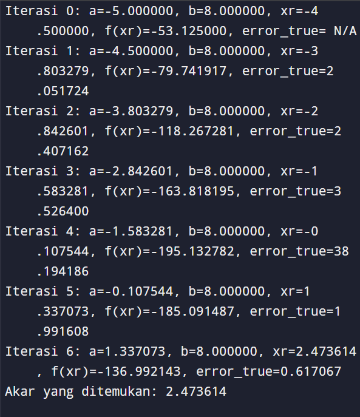

# 📌 Metode Posisi Salah (False Position Method)

Program ini menggunakan **metode posisi salah** untuk mencari akar dari fungsi non-linear. Metode ini merupakan metode numerik berbasis **interpolasi linear**.

---

## 📘 Fungsi Utama

```python
def f(x):
    return x**3 + 10*x**2 - 7*x - 196
```

### 🎯 Penjelasan:

Fungsi `f(x)` yang ingin dicari akarnya:
\[
f(x) = x^3 + 10x^2 - 7x - 196
\]

---

## 🧠 Fungsi Metode Posisi Salah

```python
def posisi_salah(a, b, xr_true, min_error = 0, max_error = 1, max_iter=100):
```

### 🎯 Parameter:

- `a`, `b`: Tebakan awal (interval `[a, b]`)
- `xr_true`: Akar sebenarnya (untuk menghitung error relatif)
- `min_error`: Batas bawah error
- `max_error`: Batas atas error (default `1`)
- `max_iter`: Iterasi maksimum (default `100`)

---

### ✏️ Proses Utama:

```python
if f(a) * f(b) >= 0:
    return None
```

Cek apakah `f(a)` dan `f(b)` memiliki tanda berbeda. Kalau tidak, akar belum tentu ada di interval tersebut.

---

```python
xr = b - (f(b) * (a - b)) / (f(a) - f(b))
```

Menghitung pendekatan akar menggunakan rumus posisi salah.

---

```python
error_true = abs((xr - xr_true) / xr)
```

Menghitung error relatif terhadap akar sebenarnya.

---

```python
if f(a) * fxr < 0:
    b = xr
else:
    a = xr
```

Update interval berdasarkan tanda dari `f(xr)`.

---

## 🚀 Menjalankan Program

```python
a = -5
b = 8
xr_true = 4
result = posisi_salah(a, b, xr_true)
```

Menjalankan fungsi dengan interval awal `[-5, 8]` dan akar sebenarnya `4`.

---

## ✅ Output



## 🛠️ Catatan

- Pastikan interval awal mengapit akar (tanda `f(a)` dan `f(b)` berbeda)
- Akurasi tergantung parameter `max_error` dan `max_iter`
